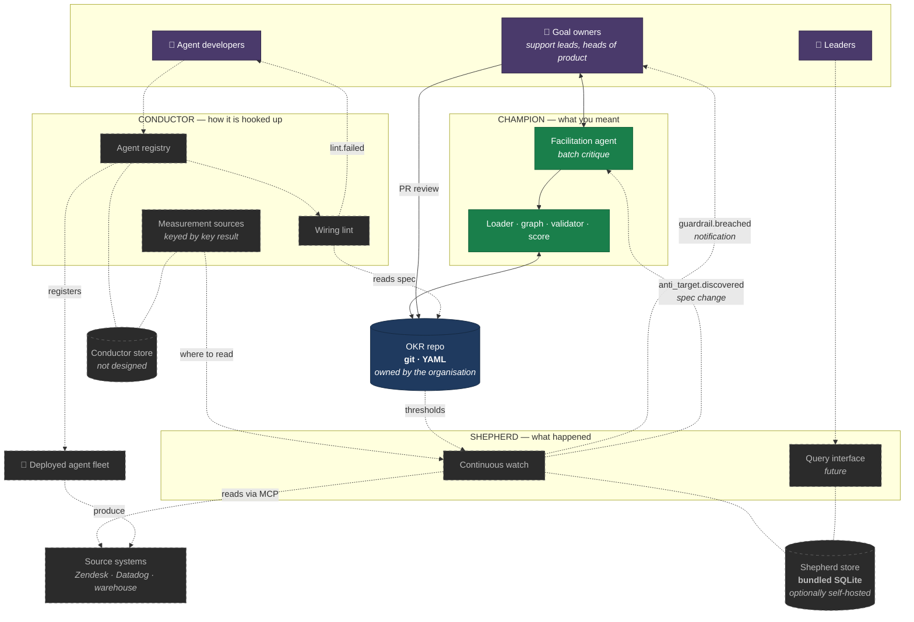
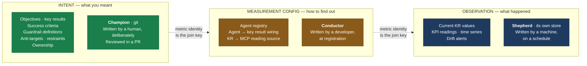
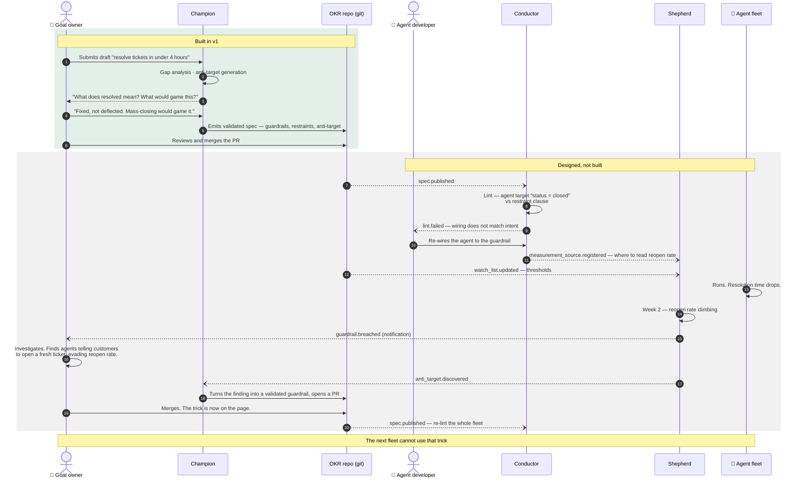

# Architecture

Three roles, three stores, one loop. Diagrams are Mermaid so they render on GitHub, diff in review, and stay in the repo alongside the decisions they illustrate.

**Read the legend.** Only a fraction of this is built. Solid means it exists in v1; dashed means it is designed and deliberately deferred by [ADR-0003](adr/0003-v1-scope.md).

---

## 1. Components and stores

**Legend:** green = built in v1 · dashed grey = designed, not built · blue = store.

Points worth reading off this diagram:

- **The OKR repo is the only store an organisation owns and sees.** The other two are implementation detail of the roles that own them. Nobody is asked to provision a database ([ADR-0001](adr/0001-git-holds-intent.md)).
- **The Shepherd needs two inputs from two different owners** — thresholds from the Champion's spec, and where-to-read from the Conductor's measurement sources. Either alone is useless, which makes their joint presence a lint the Conductor can run at wiring time.
- **Every spec change routes through the Champion, including the Shepherd's.** When the Shepherd discovers a new gaming move, it does not write to the OKR repo directly — it hands the finding to the Champion, which turns it into a well-formed guardrail and emits a validated PR a human merges. Bypassing the Champion would let unfacilitated, unvalidated spec into the graph, which is the one thing the Champion exists to prevent.
- **Notifications go direct; spec changes go through the Champion.** `guardrail.breached` tells a goal owner something is wrong and needs no facilitation. `anti_target.discovered` changes what the spec says and does.
- **`lint.failed` goes to the agent developer, not the goal owner.** A lint failure means an agent's target does not match the spec; the person who can fix it is the one who wired the agent.
- **v1 is the green box.** Three roles described in the series, one facilitation workflow and a validator built.

---

## 2. Who owns what

The distinction most easily got wrong, and the one this project got wrong twice before writing it down.

**The test that decides where a field goes:** would a machine write it on a schedule? Then it is observation and it does not belong in the schema — no exceptions for "just a small number." Does it carry a connection detail or credential? Then it is measurement config and belongs to the Conductor, not in a repo goal owners review.

**A guardrail metric's identity is the join key across all three.** The naming scheme chosen by the guardrail-metrics ADR has to make that three-way join natural.

---

## 3. The loop

Piece 3's argument in one diagram: the bridge is a loop, not a beam. The numbered path is the ticket-resolution example carried all the way round.

The property that matters: the loop does not assume the spec was right. It assumes it was incomplete, and converts each discovered gap into a line of specification the next fleet is checked against.

---

## What these diagrams do not show

- **The OKR graph's data model.** Whether a guardrail is a first-class node or an embedded field is decided by the Phase 1 schema ADRs. An ERD is a deliverable of that work, not an input to it.
- **The Conductor and Shepherd store schemas.** Both components are cut from v1; drawing their tables would present speculation as specification.
- **Anything about cycles or quarters.** v1 holds one live graph; history is git history ([ADR-0003](adr/0003-v1-scope.md)).
