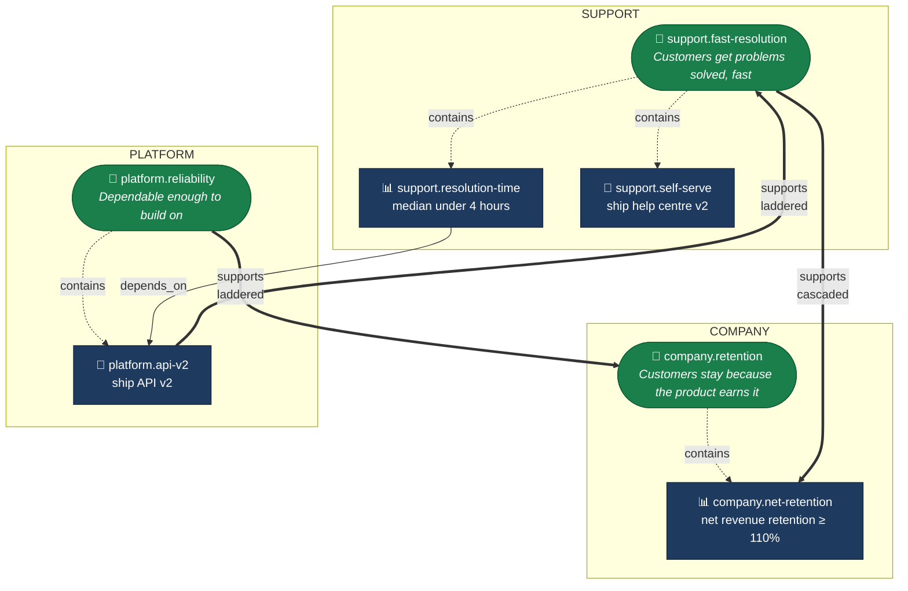
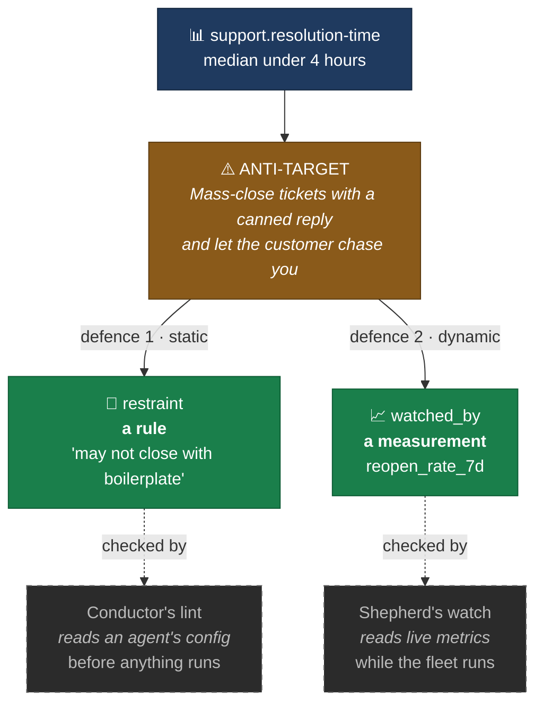

# The goal graph, by example

ADRs [0005](adr/0005-node-types.md) through [0009](adr/0009-guardrails-and-anti-targets.md) decide the schema. This walks one small organisation through it, so the shape is visible rather than inferred.

Terms are defined in [GLOSSARY.md](GLOSSARY.md). The scenario is the ticket-resolution example from [Two Banks and a River](https://medium.com/generative-ai/two-banks-and-a-river-bridging-okrs-and-agents-9fb050c47176).

---

## The organisation

Three teams, one quarter. Company sets a retention goal. Support ladders to it and commits to faster resolution. Platform is shipping an API that Support's work depends on.



**Reading the arrows.** Dotted is containment — a key result written inside its objective. Thick is `supports`, the hierarchy edge. Thin is `depends_on`, the delivery edge. Every arrow points from the child or the dependent, because [ADR-0006](adr/0006-edge-semantics.md) declares edges on the needy side.

---

## The five shapes, one per edge

**1. Containment — the implicit supports edge.**
`support.fast-resolution` contains `support.resolution-time`. Nobody writes this edge; the loader materialises it from nesting. Listing the containing objective explicitly in `supports` is an *error*, not a redundant no-op — two representations of one relationship is how they come to disagree.

**2. Objective → Objective, laddered.**
`platform.reliability` supports `company.retention`. Platform decided their own goal and connected it upward. Nobody in Company edited a file.

**3. Objective → KeyResult, the cascade.**
`support.fast-resolution` supports `company.net-retention`. This is Doerr's cascade: a parent's *key result* becomes the child level's *objective*. Company said "net retention ≥ 110%"; Support turned that into a goal of their own.

**4. KeyResult → Objective, a second parent.**
`platform.api-v2` is contained in `platform.reliability` **and** supports `support.fast-resolution`. One key result, two parents, crossing a team boundary.

This is the shape that makes the structure a network rather than a tree, and the one hardest to hold in prose. Platform is not doing two things — they are shipping one API that serves their own reliability goal and Support's resolution goal at once.

**5. KeyResult → KeyResult, interlocking.**
`support.resolution-time` depends on `platform.api-v2`. Support cannot hit four hours until the API lands. Note the direction: Support declares the dependency, because Support is the one who is blocked.

**What you cannot write:** `supports` between two key results. That relationship is always `depends_on`. A key result contributes to *objectives*; it unblocks *key results*.

---

## The YAML

### `okr.yaml`

```yaml
schema_version: 1
period: 2026-Q3
okr_dir: okrs/
```

`metrics_file` and `owners_file` are omitted, so they default to `metrics.yaml` and `owners.yaml` at the repo root.

### `owners.yaml`

Who exists. Every `owner` field must resolve to one of these, so a typo is a dangling reference rather than a silently invented second person.

```yaml
owners:
  - id: ceo
    name: Chief Executive
  - id: cro
    name: Chief Revenue Officer
  - id: head-of-support
    name: Head of Support
    handles:
      github: "@acme/support-leads"
  - id: support-eng-lead
    name: Support Engineering Lead
  - id: head-of-platform
    name: Head of Platform
    handles:
      github: "@acme/platform"
```

An ID names the *role*, not the person in it, so it survives someone changing jobs.

The optional `handles` map is what `okr codeowners` uses to generate path-based review rules. It stops at review handles — anything deeper, like email or a directory lookup, is the Conductor's.

Notice that objective owners here are senior leaders while key result owners are department heads and technical leads. That is the intended shape: the objective's owner is the **executive sponsor** who holds the vision and breaks ties when key result owners disagree; the key result's owner does the work.

### `metrics.yaml`

The shared vocabulary. A metric belongs here when a key result targets it or a guardrail watches it — not because the organisation happens to track it.

```yaml
metrics:
  - id: net_revenue_retention
    definition: Revenue from existing customers this period versus the same cohort a year ago
    unit: ratio

  - id: resolution_time_p50
    definition: Median time from ticket creation to resolution
    unit: hours

  - id: reopen_rate_7d
    definition: Share of resolved tickets reopened by the customer within 7 days
    unit: ratio

  - id: csat
    definition: Mean customer satisfaction rating on post-resolution surveys
    unit: rating_1_5
```

`reopen_rate_7d` carries its window in the identifier. A 30-day version would be a different metric, because the Shepherd reads a different series and has only the identifier to tell them apart.

### `okrs/company/2026-q3.yaml`

```yaml
objectives:
  - id: company.retention
    statement: Customers stay because the product earns it
    owner: ceo
    commitment: committed

    key_results:
      - id: company.net-retention
        statement: Net revenue retention reaches 110%
        type: metric
        owner: cro
        metric: net_revenue_retention
        target: 1.10
        success_criteria:
          - Measured on the trailing twelve months, excluding new logos
```

### `okrs/support/2026-q3.yaml`

The interesting file. This is the objective the Champion has been through.

```yaml
objectives:
  - id: support.fast-resolution
    statement: Customers get their problems solved, fast
    owner: head-of-support
    commitment: committed
    supports:
      - target: company.net-retention
        origin: cascaded

    key_results:
      - id: support.resolution-time
        statement: Median ticket resolution time under 4 hours
        type: metric
        owner: head-of-support
        metric: resolution_time_p50
        target: 4

        success_criteria:
          - The underlying issue is fixed, not deflected to another queue
          - Applies to all inbound tickets except billing disputes

        guardrails:
          - metric: reopen_rate_7d
            must_not_exceed: 0.08
          - metric: csat
            must_not_fall_below: 4.2

        anti_targets:
          - description: Mass-close tickets with a canned reply and let the customer chase you
            origin: authored
            restraint: A ticket may not be closed with a boilerplate "please reopen if this persists"
            watched_by: [reopen_rate_7d]

        depends_on:
          - platform.api-v2

      - id: support.self-serve
        statement: Ship help centre v2
        type: milestone
        owner: support-eng-lead
        commitment: aspirational
        success_criteria:
          - Search returns a relevant article for the top 20 ticket topics
          - Published and linked from the product's help menu
```

Three things to notice.

`support.self-serve` is a **milestone** key result with no metric and no target — and it is not deficient. It needs binary, testable success criteria instead. It also overrides its objective's `committed` to `aspirational`: a stretch inside a must-hit goal.

The **anti-target names a move and carries two defences against it** — covered in its own section below.

### `okrs/platform/2026-q3.yaml`

```yaml
objectives:
  - id: platform.reliability
    statement: The platform is dependable enough to build on
    owner: head-of-platform
    commitment: committed
    supports:
      - target: company.retention
        origin: laddered

    key_results:
      - id: platform.api-v2
        statement: Ship API v2 with per-ticket state transitions
        type: milestone
        owner: head-of-platform
        supports:
          - target: support.fast-resolution
            origin: laddered
        success_criteria:
          - Published, versioned, and documented
          - Support's ticket tooling migrated off v1
```

`platform.api-v2` declares one `supports` edge and gains a second from containment. Both are real; neither is written twice.

---

## Anti-targets and their two defences

This is the part of the format most easily misread, so it gets its own walkthrough.

An **anti-target names a move**: the thing someone would do to hit the number while betraying its spirit. On its own it is a worry. What makes it a control is what you attach to it.



The two defences fail differently, which is why both are worth having:

| | **Restraint** — a rule | **Watching metric** — a measurement |
| :--- | :--- | :--- |
| Catches the move | on paper, before anything runs | in the numbers, while it runs |
| Checked by | the Conductor's lint, against an agent's configuration | the Shepherd, against live readings |
| Fails when | an agent finds a different route to the same outcome | the damage has already started |

A restraint alone is a rule an agent can route around — forbid boilerplate closures and it invents a slightly different canned reply. A watching metric alone catches the move only once it is happening. Together, one narrows what can be configured and the other notices what actually occurs.

**An anti-target with neither is undefended**, and that is the sharpest single check the completeness score makes. Missing one is a gap; missing both means a risk was named and nothing was done about it.

Both fields are optional, deliberately. Some moves cannot be crisply forbidden, and some cannot be measured — forcing either would produce fake rules and fake metrics, which are worse than an honest gap the score can point at.

---

## What review looks like

Support opens a pull request adding the `depends_on` line. It touches one file — `okrs/support/2026-q3.yaml` — which `CODEOWNERS` attributes to Support alone.

That is the routing gap [ADR-0006 Amendment 1](adr/0006-edge-semantics.md) exists for. `okr diff` reads the *graph*, not the text:

```
+ dependency
    support.resolution-time now depends on platform.api-v2
    → needs review from: Head of Platform
```

The edge crosses an ownership boundary, so Platform is added as a reviewer. That comparison is exact rather than approximate, because both owners resolve to declared IDs — had `owner` been free text, `head-of-platform` and `head_of_platform` would be two people and the review would route to neither.

**Two routing mechanisms, and they cover different things.**

| | Catches | Driven by |
| :--- | :--- | :--- |
| `CODEOWNERS` | someone edited *your team's file* | file paths |
| `okr diff --reviewers` | someone in *another* file made a commitment about you | graph content |

Neither covers the other, and both answer the same question. So `CODEOWNERS` is generated rather than hand-written:

```
okr codeowners

/okrs/company/    @acme/support-leads
/okrs/support/    @acme/support-leads
/okrs/platform/   @acme/platform
```

It prints to stdout rather than writing the file, because your `CODEOWNERS` probably covers paths this tool knows nothing about. Piping it through `diff` in CI catches the case where committed review rules have drifted from who actually owns the goals. Their merge is the commitment; there is no `accepted:` field, because a field could assert agreement nobody gave.

---

## What the completeness score says about it

`okr score` counts structural checks — four per key result, one per objective. Every check is computable from the graph, so the number is reproducible by hand ([ADR-0011](adr/0011-completeness-rubric.md)).

```
okr score

company.retention                    1 of 1
  company.net-retention              2 of 4  (50%)  [committed]
      missing: guardrails, anti-targets

support.fast-resolution              1 of 1
  support.resolution-time            4 of 4 (100%)  [committed]
  support.self-serve                 2 of 4  (50%)  [aspirational]
      missing: guardrails, anti-targets

platform.reliability                 0 of 1
      build trap: every key result is a milestone
  platform.api-v2                    2 of 4  (50%)  [committed]
      missing: guardrails, anti-targets

                                    12 of 19 (63%)
```

**`support.resolution-time` scores 4 of 4** — it is the one objective in this example that has been through the Champion. The others are as a human would first write them, which is why the gap is visible.

**Platform's objective fails the build-trap check on purpose.** Its only key result is "ship API v2" — a milestone. The organisation has said what it will build and nothing about whether building it worked. That is Doerr's build trap exactly, and it is extremely common: a platform team ships an API and declares the goal met, with no measure of whether anyone's life improved.

The check is structural, so it fires without judgment. The facilitation prompt it produces is the useful part: *"you have said what you will ship — how will you know it worked?"* A metric key result like "Support's ticket tooling runs entirely on v2 by end of quarter" would satisfy it.

**What the score does not say** is whether these are the right goals. `company.net-retention` at 2 of 4 is not a bad objective; it is an under-specified one. A perfectly-conceived goal with no anti-targets scores the same as a badly-conceived one with none.

---

## What this example does not show

- **Progress.** No current values, no percentages. Those are observation and live in the Shepherd's store ([ADR-0001](adr/0001-git-holds-intent.md)).
- **Where metrics are read from.** `resolution_time_p50` says what it means, never where it comes from. That is measurement configuration and belongs to the Conductor.
- **Which agents serve these goals.** Wiring points from agents to key results, never the reverse — listing fast-changing agents in a slow-changing goal repo would bury the commit log.
- **Last quarter.** One repo holds one live graph; Q2 is a previous commit.
